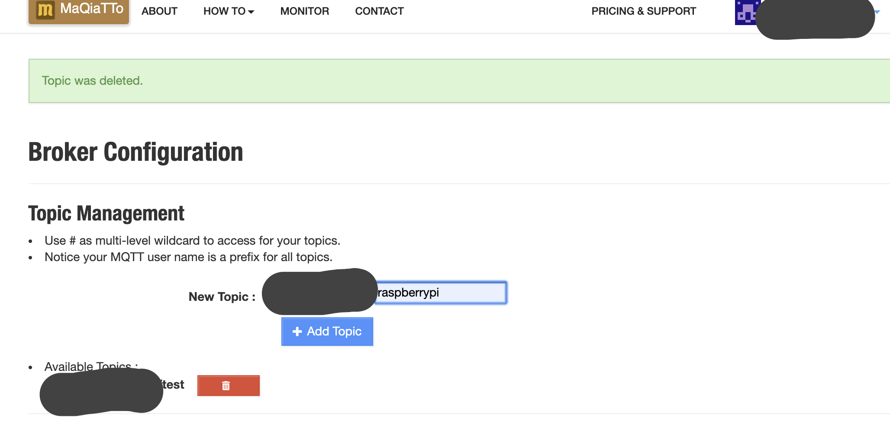
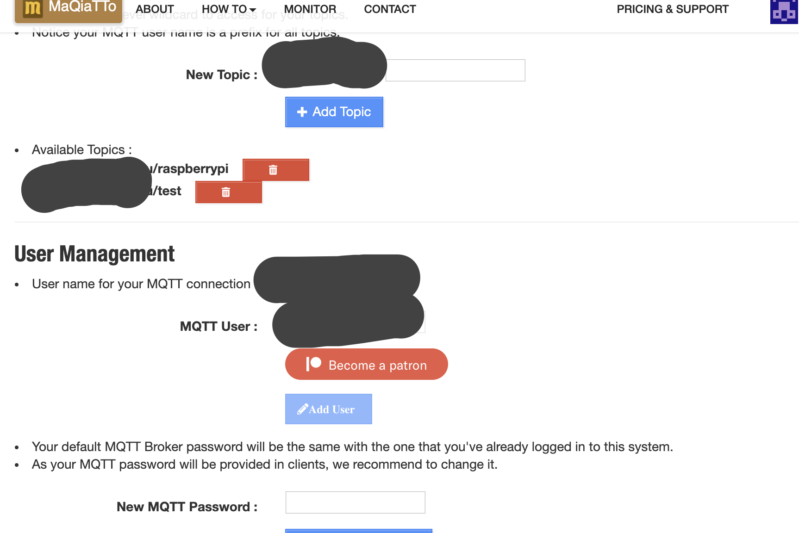
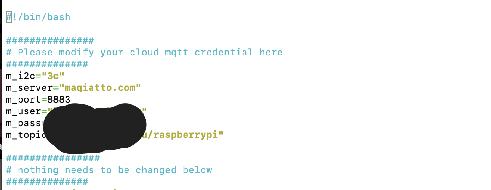

# Setup MQTT topic at [maqiatto](https://www.maqiatto.com/) 

In Broker configuration page, 



You add a topic called raspberrypi and click on "add topic". Now, you should see the topic being added




# Raspberry Pi setup

Now, we can go to the raspberry pi remote login terminal and enter the following commands

```
sudo apt-get install python-pip python-pil  i2c-tools git mosquitto-clients -y
git clone https://github.com/lbaitemple/chromebook_rpi_setup
sudo pip install Adafruit_SSD1306 RPi.GPIO
```
open the newtest2.sh file 
```
nano raspberry_IP/newtest2.sh
```

modify with your MQTT credentials for m_user and m_pass 



```
cp chromebook_rpi_setup/newtest2.sh ~/test2.sh
cp chromebook_rpi_setup/stats.py ~/stats.py
chmod +x ~/test2.sh
```

You will need to ensure a startup service to enable network
```
sudo systemctl enable systemd-networkd-wait-online.service
```
Now, you will need to create a startup service
```
sudo cp chromebook_rpi_setup/ipaddress.service /lib/systemd/system
sudo systemctl daemon-reload
sudo systemctl enable  ipaddress
sudo systemctl start  ipaddress
```

